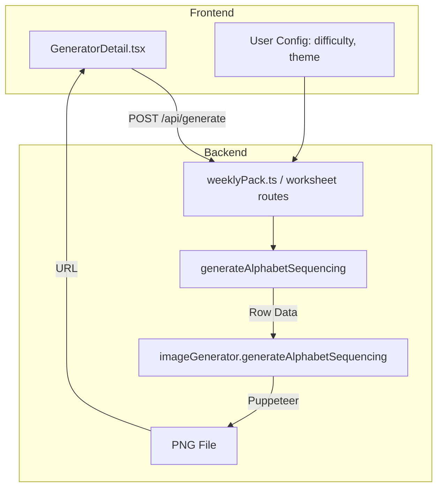

# Design Document: Alphabet Sequencing

## Overview

Alphabet Sequencing 工作表生成器是一个用于生成字母排序练习页面的功能模块。该模块包含两个主要部分：
1. **数据生成器** (`generateAlphabetSequencing`): 生成字母序列数据，包括显示序列和答案
2. **图像渲染器** (`imageGenerator.generateAlphabetSequencing`): 将数据渲染为可打印的PNG图片

系统采用现有的工作表生成架构，与其他类型的工作表（如 Letter Recognition、Number Tracing）保持一致的设计模式。

## Architecture



## Components and Interfaces

### 1. Data Generator Interface

```typescript
// 输入配置
interface AlphabetSequencingConfig {
    difficulty: 'easy' | 'medium' | 'hard';  // 难度级别
    theme: string;                            // 主题 (dinosaur, space, etc.)
}

// 单行数据
interface SequenceRow {
    sequence: string[];      // 显示序列，缺失位置为 '_'
    answers: Answer[];       // 答案数组
    fullSequence: string[];  // 完整序列（用于验证）
}

interface Answer {
    position: number;  // 缺失位置索引 (0-3)
    letter: string;    // 正确答案字母
}

// 生成器输出
interface AlphabetSequencingData {
    title: string;
    type: 'alphabet-sequencing';
    content: {
        difficulty: string;
        theme: string;
        rows: SequenceRow[];  // 8行数据
        instructions: string;
    };
}
```

### 2. Image Renderer Interface

```typescript
// 渲染器方法签名
async generateAlphabetSequencing(data: AlphabetSequencingData): Promise<string>
// 返回生成的图片URL路径
```

### 3. Page Layout Specification

```
+------------------------------------------+
|  Name: ____________    Date: ____________ |
+------------------------------------------+
|                                          |
|         🦕 Alphabet Sequencing 🦕        |
|   Fill in the missing letters to         |
|   complete the sequence                  |
|                                          |
|  ┌────────────────────────────────────┐  |
|  │  A    B    [_]   D                 │  |
|  │  ─────────────────────────────     │  |
|  ├────────────────────────────────────┤  |
|  │  M    [_]   O    P                 │  |
|  │  ─────────────────────────────     │  |
|  ├────────────────────────────────────┤  |
|  │  ... (8 rows total)                │  |
|  └────────────────────────────────────┘  |
|                                          |
|  🦖                              🦕      |
+------------------------------------------+
```

## Data Models

### Row Generation Algorithm

```
1. 选择起始位置:
   - maxStart = 26 - 4 = 22 (确保4个字母不超过Z)
   - startIdx = random(0, maxStart)
   
2. 生成完整序列:
   - fullSequence = alphabet.slice(startIdx, startIdx + 4)
   
3. 根据难度选择隐藏位置:
   - easy: 1个位置
   - medium: 2个位置
   - hard: 3个位置
   - 随机选择不重复的位置索引
   
4. 生成显示序列:
   - 将隐藏位置的字母替换为 '_'
```

### Difficulty Mapping

| Difficulty | Missing Count | Example Display |
|------------|---------------|-----------------|
| easy       | 1             | A B [_] D       |
| medium     | 2             | A [_] [_] D     |
| hard       | 3             | [_] [_] C [_]   |

## Correctness Properties

*A property is a characteristic or behavior that should hold true across all valid executions of a system-essentially, a formal statement about what the system should do. Properties serve as the bridge between human-readable specifications and machine-verifiable correctness guarantees.*

### Property 1: Row count consistency
*For any* valid configuration (any difficulty, any theme), the generated data SHALL contain exactly 8 rows.
**Validates: Requirements 1.1**

### Property 2: Sequence length and consecutiveness
*For any* generated row, the full sequence SHALL contain exactly 4 letters that are consecutive in the alphabet (e.g., A-B-C-D, not A-C-E-G).
**Validates: Requirements 1.2**

### Property 3: Missing count matches difficulty
*For any* generated worksheet with a given difficulty, each row SHALL have exactly the specified number of missing letters (easy=1, medium=2, hard=3).
**Validates: Requirements 1.3, 1.4, 1.5**

### Property 4: Valid alphabet range
*For any* generated row, all letters (both displayed and answers) SHALL be uppercase letters from A to Z.
**Validates: Requirements 3.2**

### Property 5: Starting letter diversity
*For any* generated worksheet, there SHALL be at least 3 different starting letters across all 8 rows.
**Validates: Requirements 3.4**

### Property 6: Data completeness
*For any* generated row, the data SHALL include both the display sequence (with '_' for missing) and the complete answer key.
**Validates: Requirements 6.1**

### Property 7: Serialization round-trip
*For any* valid AlphabetSequencingData object, serializing to JSON and deserializing back SHALL produce an equivalent object.
**Validates: Requirements 6.2, 6.3**

## Error Handling

| Error Scenario | Handling Strategy |
|----------------|-------------------|
| Invalid difficulty value | Default to 'easy' |
| Invalid theme value | Default to 'dinosaur' |
| Browser initialization failure | Throw error with descriptive message |
| File write failure | Throw error, log details |

## Testing Strategy

### Property-Based Testing

使用 `fast-check` 库进行属性测试，验证数据生成器的正确性。

```typescript
// 示例：测试行数一致性
fc.assert(
  fc.property(
    fc.constantFrom('easy', 'medium', 'hard'),
    fc.constantFrom('dinosaur', 'space', 'ocean'),
    async (difficulty, theme) => {
      const result = await generateAlphabetSequencing({ difficulty, theme });
      return result.content.rows.length === 8;
    }
  )
);
```

每个属性测试应运行至少 100 次迭代。

### Unit Tests

1. **数据生成器测试**
   - 测试默认配置生成
   - 测试各难度级别的缺失数量
   - 测试边界情况（起始位置接近Z）

2. **渲染器集成测试**
   - 测试PNG文件生成
   - 测试文件路径格式

### Test File Location

- 属性测试: `backend/src/services/generators/__tests__/alphabetSequencing.property.test.ts`
- 单元测试: `backend/src/services/generators/__tests__/alphabetSequencing.test.ts`
