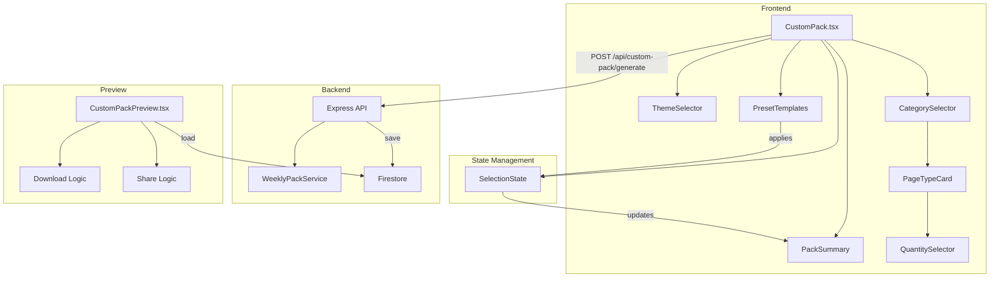

# Custom Pack Builder - Design Document

## Overview

Custom Pack Builder 是一个让用户自主定制学习合集的功能模块。与 Weekly Pack 的自动生成不同，Custom Pack 允许用户精确控制每种 worksheet 类型的数量，实现个性化的学习内容配比。

核心设计理念：
- **简洁入口**：只需选择主题（或随机），快速进入核心选择流程
- **直观操作**：可视化的分类展开、数量调整、实时摘要
- **丰富动画**：与现有 brutal design 风格一致的交互动画
- **灵活配置**：支持预设模板和完全自定义两种模式

## Architecture



## Components and Interfaces

### Frontend Components

#### 1. CustomPack.tsx (主页面)
```typescript
interface CustomPackState {
  theme: string | 'random';
  selections: Record<string, number>; // { [pageTypeId]: count }
  activePreset: string | null;
  isGenerating: boolean;
  expandedCategories: string[];
}
```

#### 2. ThemeSelector.tsx
```typescript
interface ThemeSelectorProps {
  selectedTheme: string | 'random';
  onThemeSelect: (theme: string | 'random') => void;
}
```
- 横向排列的主题卡片
- 包含"随机主题"选项（带骰子图标）
- 选中状态带 scale 和 border 动画

#### 3. CategorySelector.tsx
```typescript
interface CategorySelectorProps {
  categories: Category[];
  selections: Record<string, number>;
  expandedCategories: string[];
  onToggleCategory: (categoryId: string) => void;
  onQuantityChange: (pageTypeId: string, delta: number) => void;
}
```
- 可展开的分类卡片
- 展开时显示该分类下所有 page types
- 每个 page type 带数量选择器

#### 4. QuantitySelector.tsx
```typescript
interface QuantitySelectorProps {
  value: number;
  onChange: (delta: number) => void;
  min?: number;
  max?: number;
}
```
- 减号按钮 | 数字显示 | 加号按钮
- 数字变化时带 bounce 动画
- 最小值为 0

#### 5. PackSummary.tsx
```typescript
interface PackSummaryProps {
  selections: Record<string, number>;
  categories: Category[];
}
```
- 固定在右侧或底部的摘要面板
- 显示总页数（大字体）
- 各分类占比进度条
- 空状态提示

#### 6. PresetTemplates.tsx
```typescript
interface PresetTemplate {
  id: string;
  name: string;
  description: string;
  icon: string;
  selections: Record<string, number>;
}

interface PresetTemplatesProps {
  activePreset: string | null;
  onApplyPreset: (preset: PresetTemplate) => void;
}
```

### Backend API

#### POST /api/custom-pack/generate
```typescript
interface GenerateCustomPackRequest {
  theme: string;
  selections: Record<string, number>; // { [pageTypeId]: count }
  userId?: string;
}

interface GenerateCustomPackResponse {
  success: boolean;
  packId: string;
  pages: Array<{
    order: number;
    type: string;
    title: string;
    imageUrl: string;
  }>;
}
```

#### POST /api/custom-pack/save
```typescript
interface SaveCustomPackRequest {
  theme: string;
  selections: Record<string, number>;
  pages: GeneratedPage[];
  userId?: string;
}
```

#### GET /api/custom-pack/:packId
```typescript
interface GetCustomPackResponse {
  success: boolean;
  pack: {
    id: string;
    theme: string;
    selections: Record<string, number>;
    pages: GeneratedPage[];
    createdAt: Date;
  };
}
```

## Data Models

### Selection State
```typescript
// 存储在组件 state 中
type SelectionState = Record<string, number>;
// 例如: { 'uppercase-tracing': 2, 'maze': 3, 'coloring-page': 1 }
```

### Preset Templates
```typescript
const PRESET_TEMPLATES: PresetTemplate[] = [
  {
    id: 'balanced',
    name: 'Balanced Learning',
    description: '均衡发展，各类型平均分配',
    icon: '⚖️',
    selections: {
      'uppercase-tracing': 2,
      'number-tracing': 2,
      'maze': 2,
      'coloring-page': 2,
      // ... 共约 15-20 页
    }
  },
  {
    id: 'math-focus',
    name: 'Math Focus',
    description: '数学强化，重点练习数字和计算',
    icon: '🔢',
    selections: {
      'number-tracing': 3,
      'counting-objects': 3,
      'number-bonds': 2,
      'picture-addition': 2,
      // ... 
    }
  },
  {
    id: 'literacy-boost',
    name: 'Literacy Boost',
    description: '识字提升，专注字母和阅读基础',
    icon: '📚',
    selections: {
      'uppercase-tracing': 3,
      'lowercase-tracing': 3,
      'letter-recognition': 2,
      'beginning-sounds': 2,
      // ...
    }
  }
];
```

### Firestore Collection: customPacks
```typescript
interface CustomPackDocument {
  id: string;
  theme: string;
  selections: Record<string, number>;
  pages: Array<{
    order: number;
    type: string;
    title: string;
    imageUrl: string;
  }>;
  userId?: string;
  createdAt: Timestamp;
  totalPages: number;
}
```

## Correctness Properties

*A property is a characteristic or behavior that should hold true across all valid executions of a system-essentially, a formal statement about what the system should do. Properties serve as the bridge between human-readable specifications and machine-verifiable correctness guarantees.*

### Property 1: Theme selection state consistency
*For any* theme selection action (clicking a theme card or random option), the selected theme state SHALL be updated to exactly the clicked theme value or 'random'.
**Validates: Requirements 2.2, 2.3**

### Property 2: All categories are rendered
*For any* render of the CategorySelector component, the number of category cards displayed SHALL equal the length of the CATEGORIES constant array.
**Validates: Requirements 3.1**

### Property 3: Category expansion preserves other expansions
*For any* sequence of category toggle actions, toggling category A SHALL NOT affect the expanded state of any other category B.
**Validates: Requirements 3.4**

### Property 4: Increment increases quantity by exactly 1
*For any* page type with current quantity N, clicking the increment button SHALL result in quantity N+1.
**Validates: Requirements 4.1**

### Property 5: Decrement respects minimum bound
*For any* page type with current quantity N, clicking the decrement button SHALL result in quantity max(0, N-1).
**Validates: Requirements 4.2**

### Property 6: Total count equals sum of selections
*For any* selection state, the displayed total page count SHALL equal the sum of all values in the selections record.
**Validates: Requirements 5.1**

### Property 7: Category counts are correctly aggregated
*For any* selection state, the count displayed for each category SHALL equal the sum of quantities for all page types belonging to that category.
**Validates: Requirements 5.2**

### Property 8: Preset application sets correct quantities
*For any* preset template, applying the preset SHALL set the selections state to exactly match the preset's selections configuration.
**Validates: Requirements 6.2, 6.3**

### Property 9: Manual change clears active preset
*For any* state where a preset is active, changing any quantity manually SHALL set activePreset to null.
**Validates: Requirements 6.4**

### Property 10: Generate API receives correct payload
*For any* valid selection state with total > 0, clicking Generate SHALL send a POST request with theme and selections matching the current state.
**Validates: Requirements 7.1**

### Property 11: Generated pack page count matches selection total
*For any* successful generation, the number of pages in the response SHALL equal the sum of all selection quantities.
**Validates: Requirements 7.3**

### Property 12: Download behavior based on user plan
*For any* download action, if user.plan === 'Pro' then PDF download SHALL initiate, else navigation to pricing page SHALL occur.
**Validates: Requirements 8.1, 8.2**

### Property 13: Unauthenticated download redirects to login
*For any* download action where currentUser is null, navigation to login page SHALL occur with return URL preserved.
**Validates: Requirements 8.4**

### Property 14: Share URL contains valid pack ID
*For any* generated pack, the share URL SHALL contain the packId and be in the format `/custom-pack/preview/{packId}`.
**Validates: Requirements 10.1**

### Property 15: Shared pack loads correct data
*For any* valid pack ID in the URL, loading the preview page SHALL display pages matching the stored pack data.
**Validates: Requirements 10.3**

## Error Handling

### Frontend Errors
1. **Generation Failure**: 显示 ErrorModal，提供重试按钮
2. **Network Error**: 显示 toast 提示网络问题
3. **Empty Selection**: Generate 按钮禁用，显示提示文字

### Backend Errors
1. **Invalid Selection**: 返回 400，前端显示具体错误信息
2. **Generation Timeout**: 返回 504，前端提示稍后重试
3. **Pack Not Found**: 返回 404，前端显示"合集不存在"页面

## Testing Strategy

### Unit Testing
使用 Vitest 进行单元测试：
- 测试 selection state 的增减逻辑
- 测试 total count 计算函数
- 测试 category count 聚合函数
- 测试 preset 应用逻辑

### Property-Based Testing
使用 fast-check 进行属性测试：
- 每个 property test 配置运行 100 次迭代
- 测试文件使用 `.property.test.ts` 后缀
- 每个测试标注对应的 Property 编号和 Requirements

测试标注格式：
```typescript
// **Feature: custom-pack, Property 4: Increment increases quantity by exactly 1**
// **Validates: Requirements 4.1**
```

### Integration Testing
- 测试 Generate API 端到端流程
- 测试 Share/Load 流程
- 测试 Download 流程（mock PDF 生成）
